# 帳簿アプリ 使い方説明書（v1.0.0）

このアプリは、入出金の記録や、口座の管理を簡単にできるようにした帳簿アプリです。  
パソコンが苦手な方でも使いやすいように作られています。  
この説明書では、各画面の使い方を図と一緒にわかりやすく紹介します。

---

## 1. メニュー画面

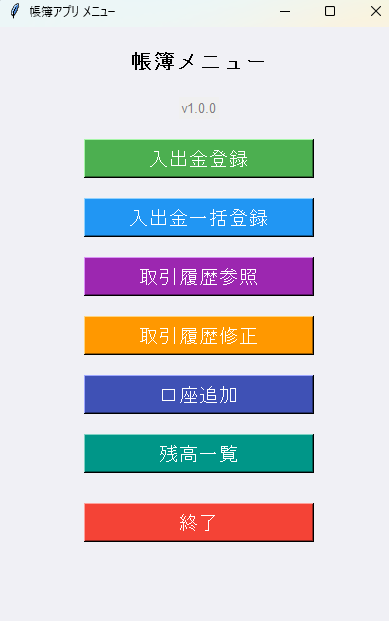

アプリを起動するとこの画面が表示されます。  
使いたい機能のボタンをクリックして操作を始めてください。

ボタンの意味は次のとおりです：

- **入出金登録**：1件ずつ記録したいときに使います
- **入出金一括登録**：まとめて複数件を入力できます
- **取引履歴参照**：過去の記録を見たり、Excelに出力できます
- **取引履歴修正**：記録した内容を直したり削除したりできます
- **口座追加**：新しい口座を登録します
- **残高一覧**：今の残高を一覧で確認できます
- **終了**：アプリを閉じます

---

## 2. 入出金登録画面

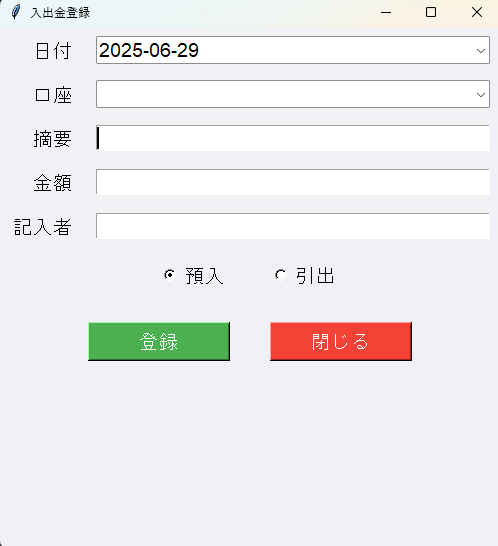

入出金を１件ずつ記録する画面です

### 使い方

#### 1. 日付を入力する

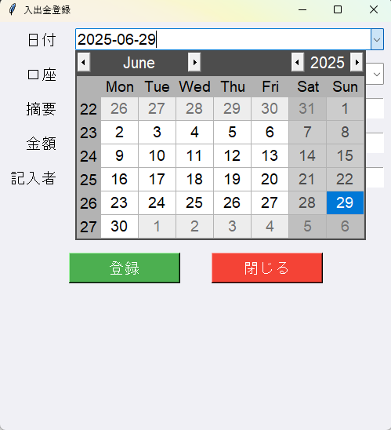

「日付」は自動的に今日の日付になりますが、変更もできます。 
[v]マークを押すとカレンダーが表示されるので、そこから指定します。

#### 2. 口座を入力する

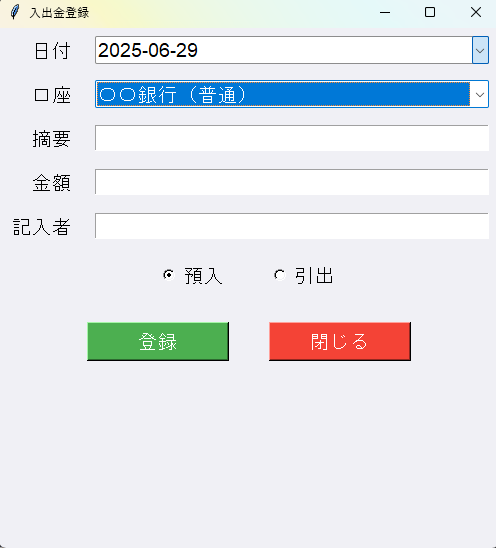

口座を入力します。 
[v]マークを押すと登録済みの口座が表示されるので、そこから指定します。 
口座が表示されない場合は、後述する口座追加画面で、口座を追加してから登録を行ってください。

#### 3. 摘要を入力する

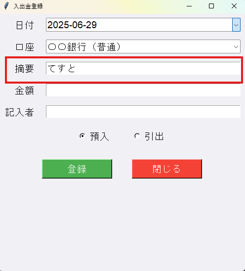

「摘要」には用途などを簡単に書きます（例：電気代、給与など）

#### 4. 金額を入力する

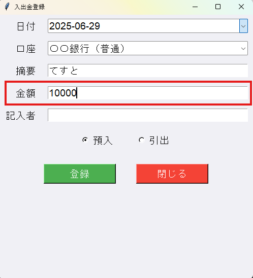

「金額」を入力します（数字だけ） 
文字や小数、負の値を入力するとエラーになります。

#### 5. 記入者を入力する

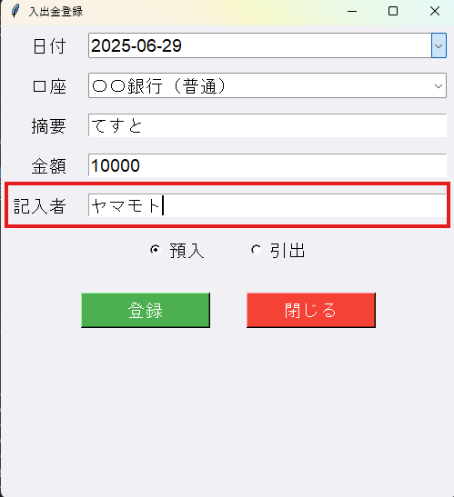

「記入者」には自分の名前を入れましょう。

#### 6. 預入・引出を選択する

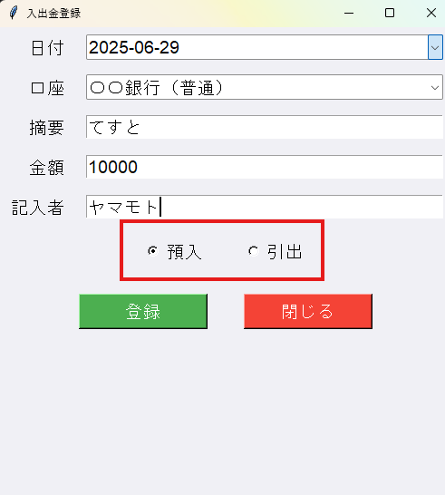

「預入（収入）」または「引出（支出）」を選んでください。

### 7. 登録する

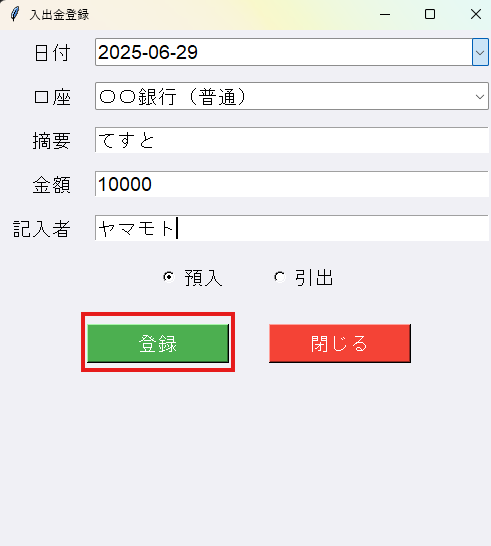

最後に「登録」を押すと、内容が記録されます

---

## 3. 入出金一括登録画面

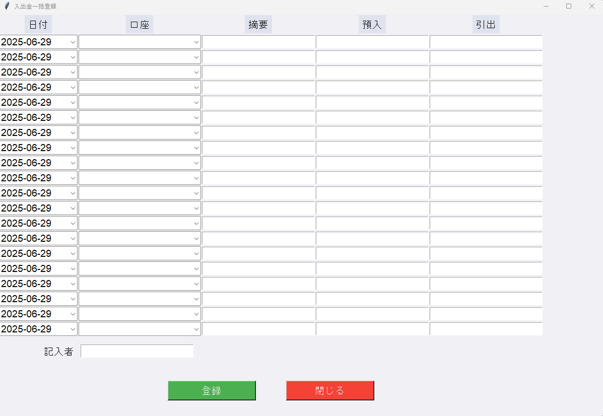

一度にたくさんの入出金を入力したいときはこちらを使います 
表になっているので、上から順番に記入します 
記入方法は入出金登録画面と同じです 
すべて入力できたら、下の「記入者」欄に名前を入れて「登録」ボタンを押します 

---

## 4. 取引履歴参照画面

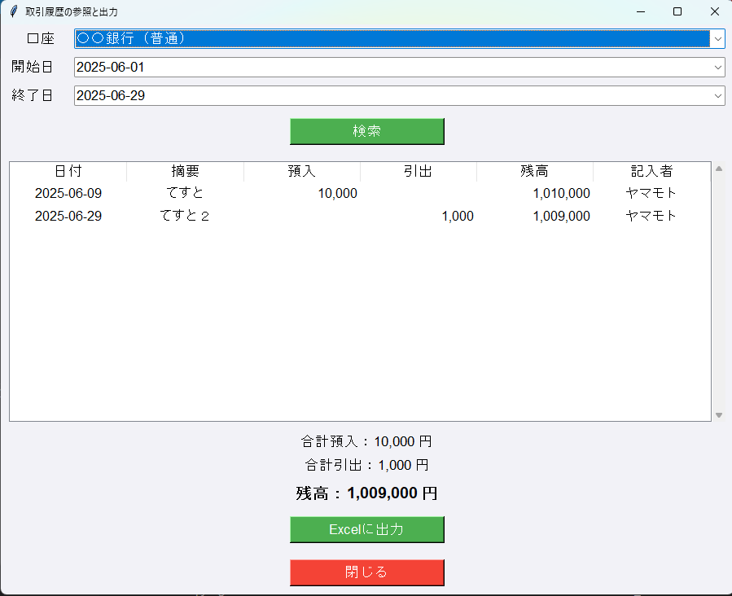

口座、期間を指定すると、取引履歴を参照できます。

### 使い方

#### 1. 口座を入力する

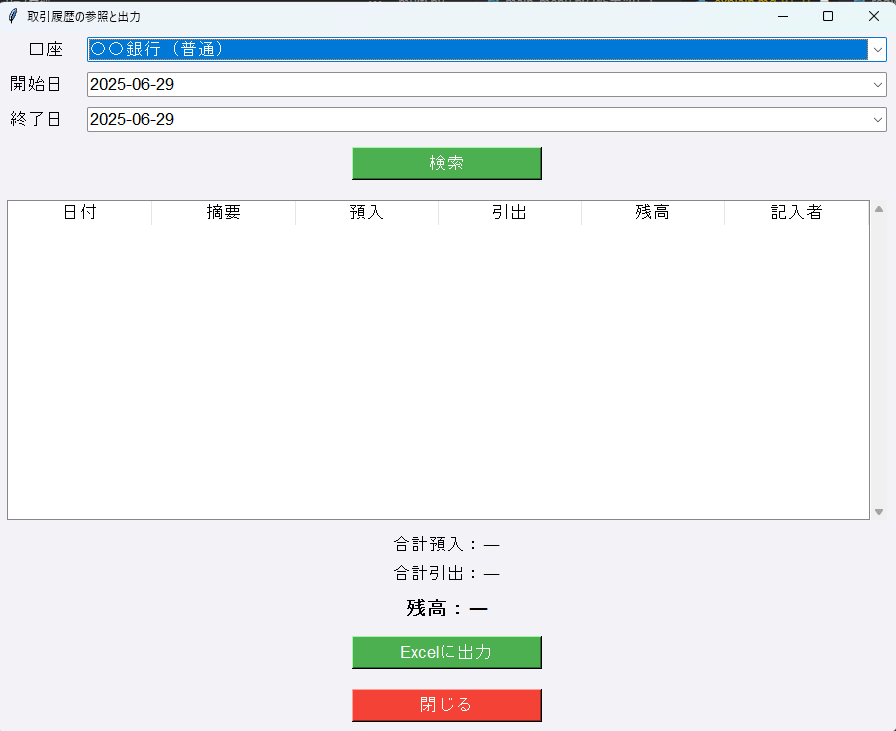

口座を入力します。 
[v]マークを押すと登録済みの口座が表示されるので、そこから指定します。

#### 2. 開始日・終了日を入力する

履歴を表示する期間を指定します。 
日付は自動的に今日の日付になりますが、変更もできます。 
[v]マークを押すとカレンダーが表示されるので、そこから指定します。

#### 3. 検索する

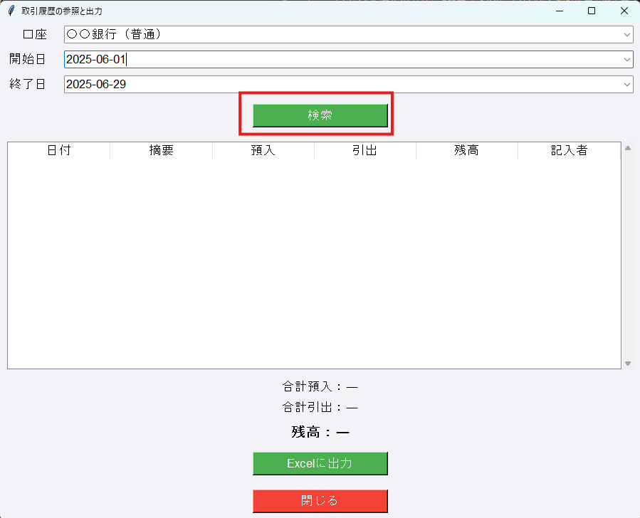

検索ボタンを押すと、画面下に入出金の履歴が表示されます。

#### 4. 履歴を確認する

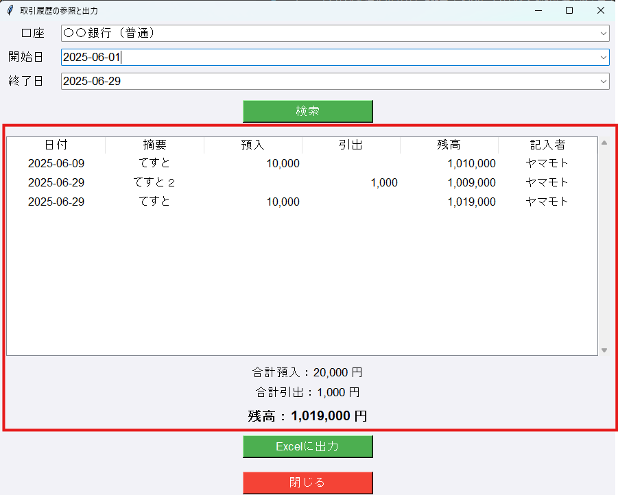

指定した口座・期間の入出金を確認します。 
その期間の合計預入、合計引出、現在の残高も確認できます。

#### 5. Excelに出力する(任意)

入出金履歴をエクセルに出力することができます。

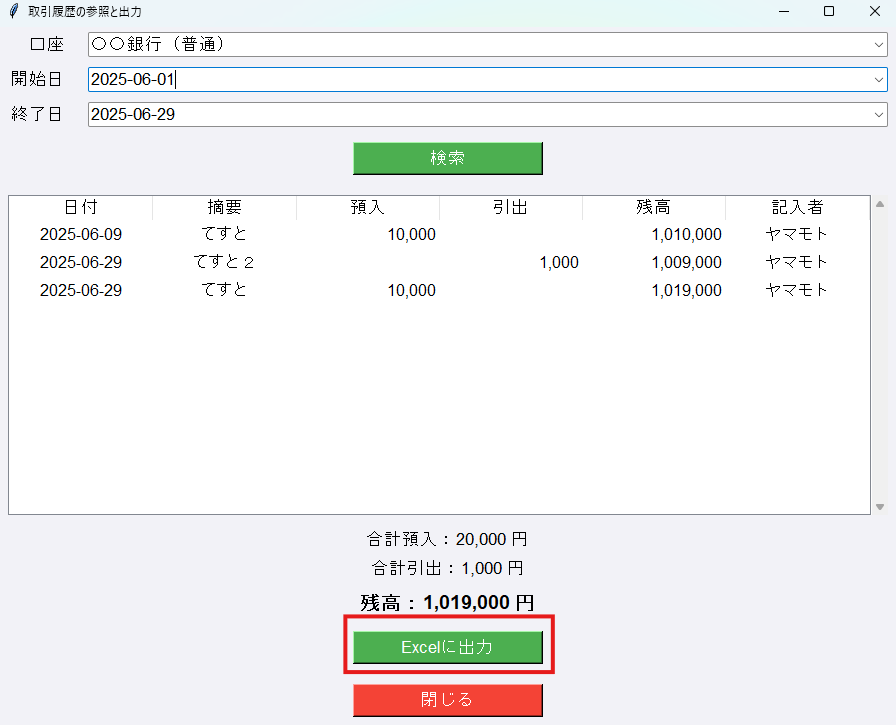
「Excelに出力」ボタンを押します

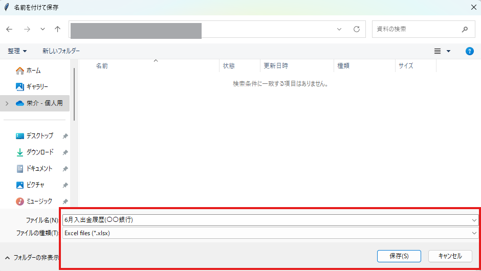
エクセルの保存先を指定し、保存します

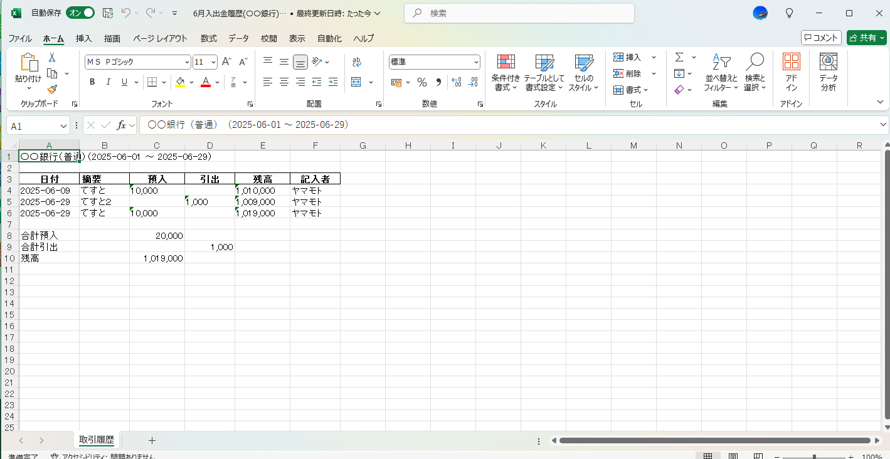
こんな感じで出力されます 
A4印刷にきれいに収まるようにしています。

---

## 5. 取引履歴の修正・削除画面

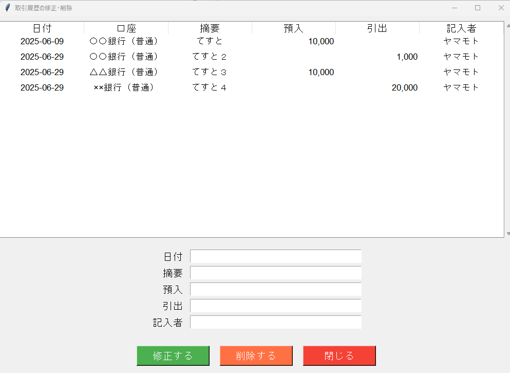

- 上の一覧から修正したい記録をクリックすると、下に内容が表示されます
- 修正したい場合は入力を直して「修正する」を押します
- 削除したい場合は「削除する」を押します（※注意して押してください）

---

## 6. 口座追加画面

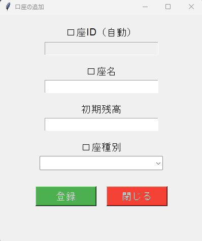

- 新しい口座を登録する画面です
- 「口座名」「初期残高」「口座種別」を入力します
- 「登録」ボタンを押すと記録されます

---

## 7. 残高一覧画面

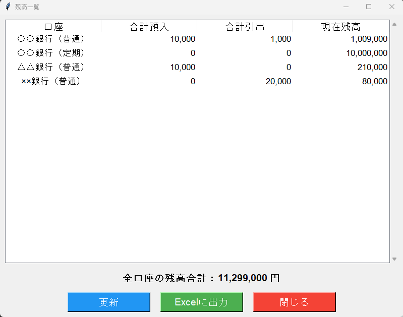

- 登録されているすべての口座の残高が表示されます
- 「更新」ボタンを押すと、最新の取引が反映されます
- 「Excelに出力」を押すと、この画面の内容をExcelで保存できます
- 一番下に全体の残高合計が表示されます

---

## 8. よくある質問

**Q. 金額の単位は？**  
A. すべて「円（日本円）」です。税別・税込の区別はありません。

**Q. 入力を間違えたらどうするの？**  
A. 「取引履歴修正」から直したり削除できます。

**Q. Excelがなくても使えるの？**  
A. アプリ自体は使えますが、出力したファイルを見るにはExcelやExcelが見られるアプリが必要です。

---

## 9. おわりに

操作に困ったときは、domburi0211@gmail.comに相談してください。  

## github
https://github.com/EisukeYamamoto/chobo

